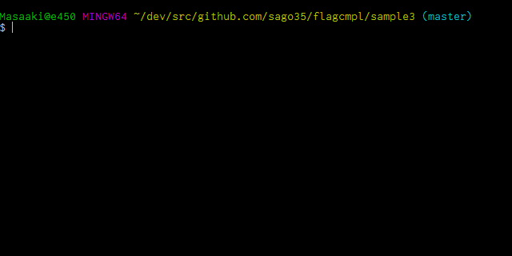

# flagcmpl
 

Package flagcmpl adds completion to flag package.

## Demo

This is a demo of ./sample3

## Usage

Use `flagcmpl.Parse()` instead of `flag.Parse()`.

    package main

    import "flag"
    import "github.com/sago35/flagcmpl"

    var verbose = flag.Bool("verbose", false, "Verbose mode.")

    func main() {
        flagcmpl.Parse()
    }

Or you can use `flag.FlagSet()`.

    package main

    import (
        "flag"
        "github.com/sago35/flagcmpl"
        "os"
    )

    func main() {
        flags := flag.NewFlagSet("sample2", flag.ExitOnError)
        flags.Bool("verbose", false, "Verbose mode.")

        flagcmpl.ParseFlagSet(os.Args[0], flags, os.Args)
    }

Add your bash_profile (or equivalent).

    eval "$(your-cli-tool --completion-script-bash)"

By ending your argv with `--`, hints for flags will be shown.

## Install

    go get github.com/sago35/flagcmpl

## Licence

[MIT](http://opensource.org/licenses/mit-license.php)

## Author

[sago35](https://github.com/sago35)

